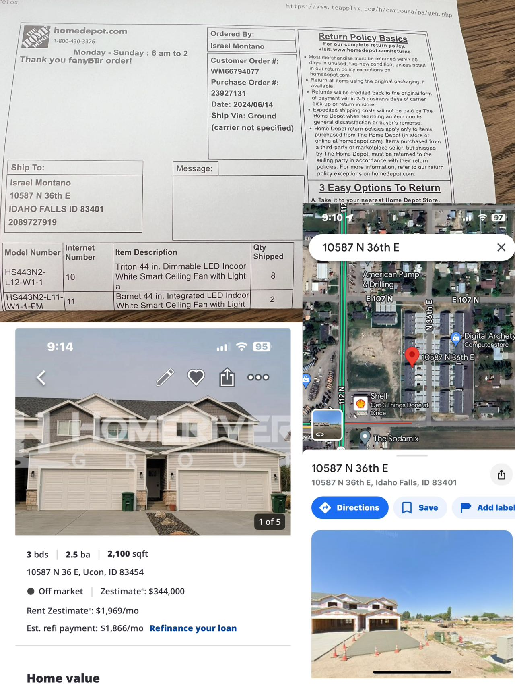

- [Carro USA Inc.](#carro-usa-inc)
  - [公司简介](#公司简介)
  - [项目需求](#项目需求)
  - [数据简介](#数据简介)
    - [1. 订单数据](#1-订单数据)
    - [2. 买家信息](#2-买家信息)
  - [筛选过程](#筛选过程)
  - [存在问题](#存在问题)
    - [1. 数据来源不统一](#1-数据来源不统一)
    - [2. 数据访问受限](#2-数据访问受限)
    - [3. 数据具有时效性](#3-数据具有时效性)
  - [模型测试](#模型测试)

# Carro USA Inc. 
## 公司简介
Carro USA Inc.
## 项目需求
在Carro发货过程中，部分订单存在产品数量与实际需求不一致的情况，以下图为例：

  
  
订单数量与实际需求不一致

上图中，发往地址为**10587 N 36th E**的产品为8件[**HS443N2-L12-W1-1**](workbook.pdf)与2件[**HS443N2-L11-W1-1-FM**](workbook.pdf)。然而经谷歌地图查询可知，该地址仅有一家面积2100平方英尺，拥有3间卧室与2.5间浴室的住宅，实际并不需该数量的电风扇产品，由此可推测背后买家可能是装修公司等优质潜在客户。因此，Carro希望从数据分析的角度，从类似订单中筛选出潜在客户进行市场营销。

## 数据简介
### 1. 订单数据
每份订单包含以下变量：
- 收件人姓名
- 订单编号
- 下单时间
- 收件人地址
- 产品编号
- 产品互联网编号
- 产品说明
- 发货数量

订单由 --- 提供
### 2. 买家信息
该项目采用github上的开源项目[**HomeHarvest**](https://github.com/Bunsly/HomeHarvest)批量获取从[**Realtor.com**](https://www.realtor.com/realestateforsale)等房地产交易平台的公开住房信息。根据输入参数的不同，返回的房产信息涵盖以下主要变量：
- 网站来源
- 交易状态
- 完整地址
- 户型
- 成交价格
- 面积
- 照片

## 筛选过程
合并订单产品数量与买家信息的数据，通过一定条件筛选出实际需求量远低于订单产品数量的买家，对其进行市场调查。

## 存在问题
### 1. 数据来源不统一
该问题主要为房产信息平台不互通，例如，某地址仅能从Zillow上查询得到，而无法从Realtor.com上获取，这对数据处理过程有较大局限。
### 2. 数据访问受限
部分平台如Zillow存在对自动抓取程序的检测和阻拦机制，使得大批量获取数据较为困难，且可能引发潜在的法律风险。
### 3. 数据具有时效性
基于各平台更新时间不同，作为抓取程序索引的房产状态会随时发生变动，对数据的可靠性具有一定影响。

## 模型测试

