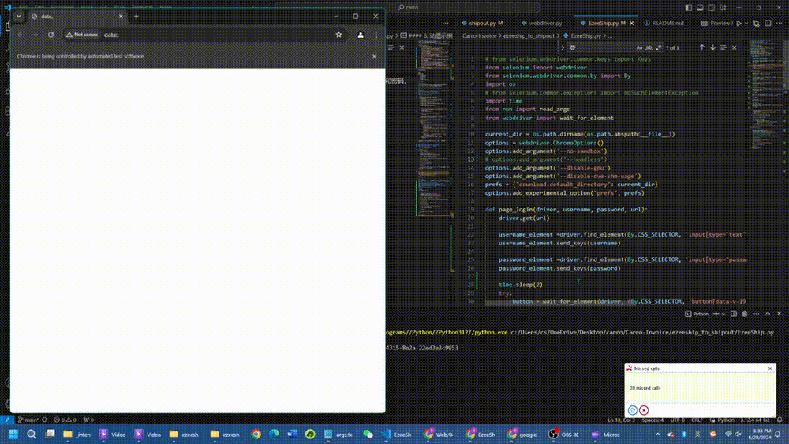

# 一键检索EzeeShip未登记退货单脚本使用说明
本工具用于自动检索EzeeShip平台上的未登记至Shipout的在途退货单。以下是使用说明，包括运行脚本，安装依赖以及处理常见问题。

- [一键检索EzeeShip未登记退货单脚本使用说明](#一键检索ezeeship未登记退货单脚本使用说明)
  - [项目结构](#项目结构)
  - [脚本文件说明](#脚本文件说明)
    - [webdriver.py](#webdriverpy)
      - [1. wait\_for\_element()：在设定时间内查找页面元素](#1-wait_for_element在设定时间内查找页面元素)
      - [2. wait\_until\_visible()：在设定时间内等待页面元素可见](#2-wait_until_visible在设定时间内等待页面元素可见)
    - [shipout.py](#shipoutpy)
      - [1. page\_login()：登录Shipout并跳转到对应页面](#1-page_login登录shipout并跳转到对应页面)
      - [2. export\_table()：导出表格数据](#2-export_table导出表格数据)
      - [3. wait\_for\_file\_download()：检索文件是否已下载](#3-wait_for_file_download检索文件是否已下载)
      - [4. shipout\_driver()：统一执行所有步骤](#4-shipout_driver统一执行所有步骤)
      - [5. 动图示例](#5-动图示例)
    - [EzeeShip.py](#ezeeshippy)
      - [1. page\_login()：用于登录EzeeShip用户页面](#1-page_login用于登录ezeeship用户页面)
      - [2. in\_transit()：用于跳转进入“In Transit”在途退货单页面](#2-in_transit用于跳转进入in-transit在途退货单页面)
      - [3. advanced\_search()：在高级检索中输入收件人地址筛选退货单](#3-advanced_search在高级检索中输入收件人地址筛选退货单)
      - [4. export\_table()：导出EzeeShip中的退货订单数据并生成Excel表格](#4-export_table导出ezeeship中的退货订单数据并生成excel表格)
      - [5. ezeeship\_driver()：统一执行所有步骤](#5-ezeeship_driver统一执行所有步骤)
      - [6. 动图示例](#6-动图示例)
    - [search.py](#searchpy)
      - [1. get\_script\_directory()：读取当前文件所在路径](#1-get_script_directory读取当前文件所在路径)
      - [2. read\_args()：读取指定路径下名为“args.txt”的文件并返回其键值对应的字典](#2-read_args读取指定路径下名为argstxt的文件并返回其键值对应的字典)
      - [3. delete\_files\_starting\_with()：删除路径内拥有指定前缀的所有文件](#3-delete_files_starting_with删除路径内拥有指定前缀的所有文件)
      - [4. read\_xls()：查找当前脚本所在目录中的 Excel 文件并将其读取为 DataFrame](#4-read_xls查找当前脚本所在目录中的-excel-文件并将其读取为-dataframe)
      - [5. check\_value()：查找已在EzeeShip表格但没有登记到Shipout表格的退货单编号](#5-check_value查找已在ezeeship表格但没有登记到shipout表格的退货单编号)
    - [main.py](#mainpy)


## 项目结构
确保项目结构如下：
```
dist/
main/
├── main.exe
├── _internal/
    ├── webdriver.py
    ├── EzeeShip.py
    ├── shipout.py
    ├── search.py
    ├── args.txt
    └── other_files.dll
```

## 脚本文件说明

### webdriver.py
用于控制脚本访问页面上某个元素的进程。具体来说，它包括了两种访问函数，`wait_for_element（driver, selector, timout）`与`wait_until_visible(driver, locator, timeout)`，以下是这两种函数的详细功能：

#### 1. wait_for_element()：在设定时间内查找页面元素
<details>
  <summary>展开查看代码</summary>

```python
def wait_for_element(driver, selector, timeout=10):
    try:
        element = WebDriverWait(driver, timeout).until(
            EC.element_to_be_clickable(selector)
        )
        return element
    except Exception as e:
        print("访问超时")
```

- `wait_for_element(driver, selector, timeout)`：创建一个WebDriverWait对象，用于在指定的时间内等待某个条件的发生。
  -  `driver`：这是一个WebDriver实例，通常用于控制浏览器。
  -  `selector`: 这是一个选择器，告诉Selenium需要在页面上找到哪个元素以及如何找到它。
  - `timeout`：这是等待该元素出现的最长时间，如果未能等到该元素加载完成，将会抛出超时异常。
</details>

_________________
#### 2. wait_until_visible()：在设定时间内等待页面元素可见
<details>
  <summary>展开查看代码</summary>

```python
def wait_until_visible(driver, locator, timeout=10):
    try:
        wait = WebDriverWait(driver, timeout)
        element = wait.until(EC.visibility_of_element_located(locator))
        return element
    
    except Exception as e:
        print("访问超时")
```
- `wait_until_visible(driver, locator, timeout)`：功能同上，用于等待页面上某个元素变得可见，并在元素可见后执行操作（例如点击）。输入参数与`wait_for_element()`功能一致

</details>

_________________


### shipout.py  
用于执行Shipout中导出退货订单的功能。包括登录、导航到退货管理页面、导出数据以及下载 Excel 表格等步骤。以下为各函数的具体功能：

#### 1. page_login()：登录Shipout并跳转到对应页面
<details>
  <summary>展开查看代码</summary>

```python
def page_login(driver, username, password, url):
    # 打开给定的 URL
    driver.get(url)

    # 找到并填写用户名
    username_element = driver.find_element(By.CLASS_NAME, 'ez-input__inner')
    username_element.send_keys(username)

    # 找到并填写密码
    password_element = driver.find_element(By.XPATH, '//input[@type="password" and @autocomplete="off" and contains(@class, "ez-input__inner")]')
    password_element.send_keys(password)

    try:
        # 找到并点击登录按钮
        button = wait_for_element(driver, (By.CSS_SELECTOR, '.ez-button.login-submit.ez-button--primary.ez-button--medium'))
        button.click()
        print("已成功登录Shipout")
    except:
        # 登录失败处理
        print("Shipout账号或密码输入错误，请重新输入")
        driver.quit()

    # 选择仓库
    warehouse_element = wait_for_element(driver, (By.XPATH, '//div[contains(text(), "Upland，CA")]'))
    warehouse_element.click()

    # 展开子菜单并跳转至“退货管理-退货单”页面
    max_retries = 10  # 最大重试次数
    sleep_interval = 2  # 重试间隔时间（秒）
    retries = 0  # 当前重试次数

    while retries < max_retries:
        try:
            # 找到并点击父菜单
            parent_element = wait_for_element(driver, (By.XPATH, '//*[@id="app-root-wrap"]/section/aside/div/div[1]/div/ul/li[3]/div/div/div'))
            parent_element.click()

            # 找到并点击子菜单
            rt = wait_for_element(driver, (By.XPATH, '/html/body/div[2]/ul/li[1]/div/span'))
            rt.click()
            print("Shipout - 已成功跳转至“退货管理-退货单”页面")
            break  # 成功跳转后跳出循环
        except:
            # 请求失败处理
            retries += 1
            print("Shipout - 当前页面请求失败，重试次数：", retries)
            time.sleep(sleep_interval)
    else:
        # 超时处理
        print("Shipout - 页面请求已超时，请重新执行文件")
        driver.quit()

```

- `page_login(driver, username, password, url)`：用于访问Shipout登录界面并输入用户名和密码，选择仓库地址，以及跳转至“退货管理-退货单”页面。
</details>

_________________
#### 2. export_table()：导出表格数据
<details>
  <summary>展开查看代码</summary>

```python
def export_table(driver):
    max_retries = 10  # 最大重试次数
    sleep_interval = 2  # 重试间隔时间（秒）
    retries = 0  # 当前重试次数

    while retries < max_retries:
        try: 
            # 找到并点击“全部”按钮
            all_button = wait_for_element(driver, (By.XPATH, '//*[@id="tab-0"]'))
            all_button.click()
            print("Shipout - 已选择查看“全部”退货单，正在尝试导出所有表格")

            # 找到并点击“导出”按钮
            export_button = wait_for_element(driver, (By.XPATH, '//*[@id="app-root-wrap"]/section/section/main/div/header/div/div[2]/div[2]/button'))
            export_button.click()
            print("Shipout - 已选择“导出”")

            # 找到并点击“导出当前所有数据”选项
            all_filtered = wait_for_element(driver, (By.XPATH, "//ul[contains(@id, 'dropdown-menu-')]/li[2][normalize-space()='Export All Filtered Orders' or normalize-space()='导出当前所有数据']"))
            all_filtered.click()
            print("Shipout - 已选择“导出当前所有数据”")
            print("Shipout - 已导出退货单表格")
            break  # 成功导出后跳出循环
        except Exception as e:
            retries += 1
            print("Shipout - 请求失败，正在尝试重新下载表格，重试次数：", retries)
            time.sleep(sleep_interval)
    else:
        print("Shipout - 页面请求已超时，请重新执行文件")   
        driver.quit()  # 超时后关闭浏览器

```

- `export_table(driver)`：定位至“全部”退货单页面并导出所有数据。由于该页面加载所需时间较长，可能会导致导出文件的请求失败。在这种情况下，该函数会重复执行并记录失败次数直至导出文件，若请求超时，请联系技术人员处理。
</details>

_________________
#### 3. wait_for_file_download()：检索文件是否已下载
<details>
  <summary>展开查看代码</summary>

```python
def wait_for_file_download(prefix, timeout=100):
    # 计算超时时间点
    end_time = time.time() + timeout
    # 获取当前脚本所在目录
    script_dir = os.path.dirname(os.path.abspath(__file__))

    while time.time() < end_time:
        # 遍历当前目录下的所有文件
        for filename in os.listdir(script_dir):
            # 检查文件名是否以指定前缀开头
            if filename.startswith(prefix):
                print(f"Shipout - 已查找到下载文件: {filename}")
                return True
        # 等待一秒钟后再检查
        time.sleep(1)

    print(f"Shipout - 下载超时，未能在当前目录找到以 '{prefix}' 为前缀的文件名")
    return False

```
- `wait_for_file_download(prefix, timeout=100)`：遍历当前路径内文件，查询是否已下载生成的Excel表格。
  - `prefix`：读取该路径内文件的前缀，如“WMS_Return_Export”为Shipout输出文件的固定前缀。
  - 
</details>

_________________
#### 4. shipout_driver()：统一执行所有步骤
<details>
  <summary>展开查看代码</summary>

```python
def shipout_driver():
    # 读取参数
    params = read_args()

    # 获取 Shipout URL、用户名和密码
    shipout_url = params.get('shipout_url')
    shipout_username = params.get('shipout_username')
    shipout_password = params.get('shipout_password')

    # 初始化 Chrome 浏览器
    driver = webdriver.Chrome(options=options) 

    # 登录页面
    page_login(driver, shipout_username, shipout_password, shipout_url)

    # 导出表格
    export_table(driver)

    # 文件前缀
    prefix = "WMS_Return_Export"

    # 等待文件下载
    wait_for_file_download(prefix)

    # 退出浏览器
    driver.quit()
```

- `shipout_driver()`：读取同路径内<u>**args.txt**</u>内的登录账户名和密码，执行上述所有操作，并退出浏览器控制。
</details>

_________________

#### 5. 动图示例

以下为<u>**shipout.py**</u>的自动操作动图示例：
<div style="text-align: center;">
  
</div>

_________________

### EzeeShip.py
用于执行从EzeeShip中导出退货订单的功能。包括登录、导航到Shipments-In Transit页面、设置高级检索，导出数据以及下载 Excel 表格等步骤。以下为各函数的具体功能：

#### 1. page_login()：用于登录EzeeShip用户页面
<details>
  <summary>展开查看代码</summary>

```python
def page_login(driver, username, password, url):
    driver.get(url)

    username_element =driver.find_element(By.CSS_SELECTOR, 'input[type="text"][autocomplete="username"].el-input__inner')
    username_element.send_keys(username)

    password_element =driver.find_element(By.CSS_SELECTOR, 'input[type="password"][autocomplete="password"].el-input__inner')
    password_element.send_keys(password)
    try:
        button = wait_for_element(driver, (By.CSS_SELECTOR, 'button[data-v-1915e4d0][type="submit"].el-button.login-submit-button'))
        button.click()
        print("已成功登录EzeeShip")
    except:
        print("EzeeShip账号或密码输入错误，请重新输入")
        driver.quit()
```

- `page_login(driver, username, password, url)`：用于访问Shipout登录界面并输入用户名和密码，选择仓库地址，以及跳转至“退货管理-退货单”页面。
    - `driver`： WebDriver实例，通常用于控制浏览器
    - `username`：用于登录EzeeShip的用户名，读取自<u>**args.txt**</u>
    - `password`：用于登录EzeeShip的密码，读取自<u>**args.txt**</u>
    - `url`：EzeeShip用户登录界面网址

</details>

_________________
#### 2. in_transit()：用于跳转进入“In Transit”在途退货单页面
<details>
  <summary>展开查看代码</summary>

```python
def in_transit(driver):

    shipments_element = wait_for_element(driver, (By.XPATH, '//span[contains(text(), "Shipments")]'))
    shipments_element.click()
    print("EzeeShip - 已成功转入“Shipment”页面")

    in_transit_element =  wait_for_element(driver, (By.XPATH, '//span[contains(text(), "In Transit")]'))
    in_transit_element.click()
    print("EzeeShip - 选择“In Transit”订单")

    all_element = wait_for_element(driver, (By.XPATH, '//*[@id="app"]/div[1]/div[2]/div[1]/ul/div/li[3]/ul/div/li[1]/span'))
    all_element.click()
    print('EzeeShip - 点击“All”')

```
- `in_transit(driver)`：依次操作浏览器点击“Shipment”选项，在进入页面后点击网页左侧目录的“In Transit"选项，最后点击下拉目录中的“All”选项，调出所有在途退货单数据。  
</details>

_________________

#### 3. advanced_search()：在高级检索中输入收件人地址筛选退货单
<details>
  <summary>展开查看代码</summary>

```python
def advanced_search(driver, address):

    advanced_search = driver.find_element(By.XPATH, '//*[@id="app"]/div[1]/div[2]/div[2]/div/div/div/div[1]/div/div[2]/div[1]/section/i[1]')
    advanced_search.click()
    print('EzeeShip - 进入Advanced Search')

    address_input = wait_for_element(driver, (By.XPATH, '//*[@id="app"]/div[1]/div[2]/div[2]/div/div/div/div[1]/div/div[2]/section/div/form/div[2]/div[2]/div/div/div/input'))
    address_input.send_keys(address)
    print('EzeeShip - 输入“Recipient Address"仓库地址：', address)

    confirm = wait_for_element(driver, (By.XPATH, '//*[@id="app"]/div[1]/div[2]/div[2]/div/div/div/div[1]/div/div[2]/section/div/div/button[1]'))
    confirm.click()
    print('EzeeShip - 点击确认')

```
- `advanced_search(driver, address)`：点击页面上“Advanced Search”的选项，在“Recipient”一栏输入对应仓库的收件人地址（如Upland是“1037”），并点击“Confirm”实现筛选对应退货单。
    - `address`是仓库的收货地址，如“Upland”仓库为1037，该地址需使用者在<u>**args.txt**</u>文件中的“ezeeship_recipient_address”一栏手动修改。
</details>

_________________
#### 4. export_table()：导出EzeeShip中的退货订单数据并生成Excel表格
<details>
  <summary>展开查看代码</summary>

```python
def export_table(driver):
    export_button = driver.find_element(By.XPATH, '//*[@id="app"]/div[1]/div[2]/div[2]/div/div/div/div[1]/div/div[1]/div[1]/div[1]/div[7]/div/div/button')
    export_button.click()

    try:

        by_order = wait_for_element(driver, (By.XPATH, "//ul[contains(@id, 'dropdown-menu-')]/li[1]/span[contains(text(), 'By Order')]"))
        by_order.click()
        print('EzeeShip - 选择“By Order”，正在尝试导出文件')
    except:
        print("EzeeShip - 导出文件失败")
```

- `export_table(driver)`：操作浏览器点击页面上方的“Export Shipment Info”选项，并选择“By Order”，生成所有在途退货单的Excel表格。
</details>

_________________
#### 5. ezeeship_driver()：统一执行所有步骤
<details>
  <summary>展开查看代码</summary>

```python
def ezeeship_driver():
    # 读取参数文件中的配置
    params = read_args()

    # 获取EzeeShip的相关参数
    ezeeship_url = params.get('ezeeship_url')
    ezeeship_username = params.get('ezeeship_username')
    ezeeship_password = params.get('ezeeship_password')
    ezeeship_address = params.get('ezeeship_recipient_address')

    # 启动Chrome浏览器
    driver = webdriver.Chrome(options=options)

    # 登录到EzeeShip页面
    page_login(driver, ezeeship_username, ezeeship_password, ezeeship_url)

    # 进入在途页面
    in_transit(driver)

    # 执行高级搜索
    advanced_search(driver, ezeeship_address)

    # 导出表格数据
    export_table(driver)

    # 定义文件前缀
    prefix = "Shipment_Information(by order)(all).xls"

    # 等待文件下载完成
    wait_for_file_download(prefix)

    # 关闭浏览器
    driver.quit()
```
- `ezeeship_driver()`：读取同路径内<u>**args.txt**</u>内的登录账户名和密码，执行上述所有操作，并退出浏览器控制。
</details>

_________________

#### 6. 动图示例
以下为<u>**EzeeShip.py**</u>的自动操作动图示例：
<div style="text-align: center;">
  
</div>

_________________

### search.py
用于检索并清除当前路径内上一次执行生成的文件并返回结果，每次执行程序时都会重新启动。其内部函数说明如下：

#### 1. get_script_directory()：读取当前文件所在路径
<details>
  <summary>展开查看代码</summary>

```python
def get_script_directory():
    return os.path.dirname(os.path.abspath(__file__))
```
- `get_script_directory()`：读取当前文件所在的绝对路径
</details>

_________________

#### 2. read_args()：读取指定路径下名为“args.txt”的文件并返回其键值对应的字典
<details>
  <summary>展开查看代码</summary>

```python
def read_args(file_path=None):
    # 如果没有指定文件路径，使用默认路径 'args.txt'
    if file_path is None:
        file_path = os.path.join(get_script_directory(), 'args.txt')
    
    params = {}
    
    # 打开文件并读取每一行
    with open(file_path, 'r') as file:
        for line in file:
            line = line.strip()  # 去掉每行两端的空白字符
            if line:
                key, value = line.split(' = ', 1)  # 按照 ' = ' 分割每一行，最多分割一次
                params[key] = value  # 将键值对存入字典中
    
    return params

```
- `read_args(file_path = None)`：指定默认文件路径为当前所在文件夹 + 'args.txt'，返回字典。其效果如下：
```
# 原args.txt文件如下
shipout_url = https://wms.shipout.com/z/#/login?lang=en

shipout_username = support@carrohome.com

shipout_password = Carrohome#23

ezeeship_url = https://ezeeship.com/newstyle/#/accredit/login

ezeeship_username = jacksoneatvivi@gmail.com

ezeeship_password = Carrohome#1

ezeeship_recipient_address = 1037

# 调用read_args()后返回如下字典：
{
    'shipout_url': 'https://wms.shipout.com/z/#/login?lang=en', 'shipout_username': 'support@carrohome.com', 
    'shipout_password': 'Carrohome#23', 
    'ezeeship_url': 'https://ezeeship.com/newstyle/#/accredit/login', 
    'ezeeship_username': 'jacksoneatvivi@gmail.com', 'ezeeship_password': 'Carrohome#1', 
    'ezeeship_recipient_address': '1037'

}

```
</details>

_________________

#### 3. delete_files_starting_with()：删除路径内拥有指定前缀的所有文件
<details>
  <summary>展开查看代码</summary>

```python
def delete_files_starting_with(prefix):

    # 获取当前脚本所在目录
    directory = get_script_directory() 
   
    try:
        # 查找所有以指定前缀开头的文件
        files_to_delete = [filename for filename in os.listdir(directory) if filename.startswith(prefix)]
        
        if files_to_delete:
            # 删除找到的文件
            for filename in files_to_delete:
                os.remove(os.path.join(directory, filename))
                print(f"已删除文件: {filename}")
        else:
            print(f"并未找到以 '{prefix}'为前缀的文件，删除终止")

    except OSError as e:
        print(f"Error: {e.strerror}")
```
- `delete_files_starting_with(prefix)`：是删除当前脚本所在目录中以指定前缀开头的文件。
  - `prefix`：指定前缀示例：EzeeShip文件前缀为“Shipment_Information(by order)(all)”，Shipout文件前缀为“WMS_Return_Export”。

</details>

_________________

#### 4. read_xls()：查找当前脚本所在目录中的 Excel 文件并将其读取为 DataFrame
<details>
  <summary>展开查看代码</summary>

```python

def read_xls(prefix):
    directory = get_script_directory()

    # 遍历目录中的所有文件名，查找以指定前缀 prefix 开头的文件
    file_to_read = next((filename for filename in os.listdir(directory) if filename.startswith(prefix)), None)
    
    if file_to_read: # 如果找到匹配的文件
        file_path = os.path.join(directory, file_to_read) # 构建文件的完整路径
        # 读取 Excel 文件，将其内容加载到一个 DataFrame 中。header=0 表示将第一行作为列名。
        df = pd.read_excel(file_path, header=0)
        return df
    else:
        print(f"未找到以 '{prefix}'为前缀的文件名")
        return None
```
- `read_xls(prefix)`：根据指定的前缀查找当前脚本所在目录中的 Excel 文件，并将其读取为 DataFrame。
  - `prefix`：指定文件前缀名，如`prefix = 产品`，则所有开头带有“产品”二字的Excel文件都将会被提取。
</details>

_________________

#### 5. check_value()：查找已在EzeeShip表格但没有登记到Shipout表格的退货单编号
<details>
  <summary>展开查看代码</summary>

```python
def check_value(df1, df2):
    def is_contained(order_no):
        order_no_lower = order_no.lower() # 统一把"-return"后缀转为小写
        return any(order_no_lower in str(rma).lower() for rma in df2['RMA #'])
    # 找到已经登记在df1但没有登记到df2的订单编号
    mask = df1['Order No'].apply(lambda x: not is_contained(x))
    missing_values_df = df1[mask][['Order No', 'Tracking ID', 'Reference', 'Reference2']]
    return missing_values_df

```
- `check_value(df1, df2)`：查找已在EzeeShip表格中登记，但并未在Shipout表格中登记退货单编号，并生成名为`missing_values_df`的DataFrame。
  - `is_contained(order_no)`：将所有退货单编号的后缀“-Return”统一转为小写以方便比对，并通过内置函数`any()`，判断df1表格中每一行编号是否同时存在于df2表格中，并返回布尔值。
  - `df1`：储存表格的变量名，此处为Ezeeship生成的Excel表格
  - `df2`：储存Shipout表格的变量名
</details>

_________________


### main.py
脚本的主要执行文件。执行一系列操作以删除旧文件、运行两个独立的功能模块（ezeeship_driver 和 shipout_driver），读取生成的Excel文件，并检查退货单编号在两个数据集中是否存在，然后将未登记的编号写入到一个文本文件中。

<details>
  <summary>展开查看代码</summary>

```python
ezeeship_prefix = "Shipment_Information(by order)(all)"
shipout_prefix = "WMS_Return_Export"

if __name__ == "__main__":

    # 删除旧文件
    delete_files_starting_with(ezeeship_prefix)
    delete_files_starting_with(shipout_prefix)
    delete_files_starting_with('未登记订单')

    # 创建线程来运行 ezeeship_driver 和 shipout_driver 函数
    thread1 = threading.Thread(target=ezeeship_driver)
    thread2 = threading.Thread(target=shipout_driver)

    # 启动线程
    thread1.start()
    thread2.start()

    # 等待两个线程都完成
    thread1.join()
    thread2.join()
    
    # 读取生成的Excel文件
    ezeeship_df = read_xls(ezeeship_prefix)
    shipout_df = read_xls(shipout_prefix)

    # 获取脚本目录路径      
    script_dir = get_script_directory()
    file_path =  os.path.join(script_dir, '未登记订单.txt')

    # 将未登记的订单写入到文本文件
    with open(file_path, 'w') as file:
        file.write(tabulate(check_value(ezeeship_df, shipout_df), headers = 'keys', tablefmt='grid'))
    print('已打印所有未登记订单')
  
  ```
  </details>

